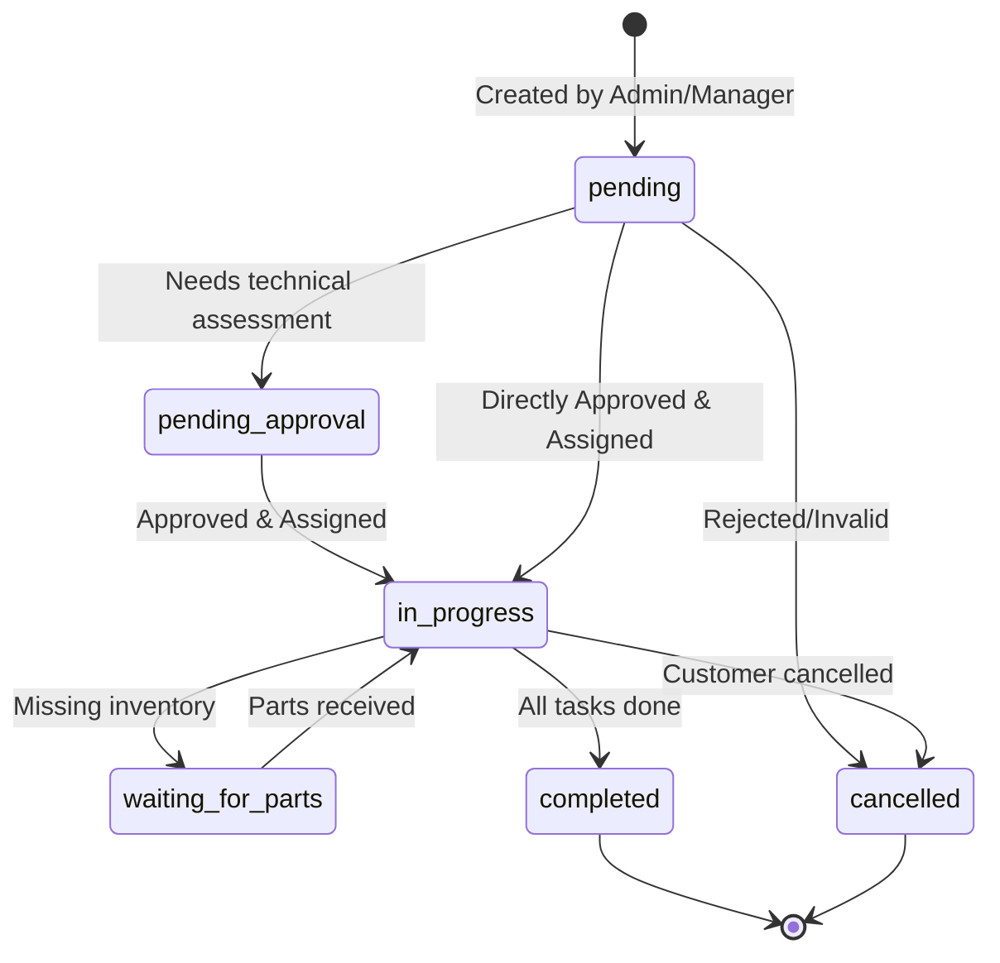

# Tech Job Tracking System - System Documentation

This document contains key architectural diagrams and business logic to help understand the scope of the project, especially useful for university project presentations.

## 1. Job State Transition Diagram

The core functionality of this system revolves around the `Job` (งานที่ได้รับมอบหมาย). A job goes through several states from creation to completion.



## 2. Role-Based Access Control (RBAC) Use Case
Here is a high-level overview of what each user role is permitted to do in the system:

```mermaid
usecaseDiagram
    actor "Admin (ผู้ดูแลระบบ)" as admin
    actor "Manager (ผู้จัดการ)" as manager
    actor "Lead Technician (หัวหน้าช่าง)" as lead
    actor "Employee (ช่าง/พนักงาน)" as emp

    package "Tech Job System" {
        usecase "Create Jobs" as UC1
        usecase "Approve Jobs" as UC2
        usecase "Assign Employees" as UC3
        usecase "Export Reports/CSV" as UC4
        usecase "Update Job Status" as UC5
        usecase "Manage Inventory" as UC6
        usecase "View Assigned Jobs" as UC7
    }

    admin --> UC1
    admin --> UC2
    admin --> UC3
    admin --> UC4
    admin --> UC6

    manager --> UC1
    manager --> UC2
    manager --> UC3
    manager --> UC4

    lead --> UC5
    lead --> UC7

    emp --> UC5
    emp --> UC7
```

## 3. Notable Security Features Implemented
* **Input Validation**: using `Zod` in the Backend API to validate all incoming JSON data against strict schemas (e.g. `src/app/api/jobs/route.ts`).
* **Route Protection**: Next-Auth session checks on both Frontend components and Backend API routes (preventing Employees from creating jobs if circumventing UI).
* **Information Hiding**: Employees only see data related to their assigned jobs. Admins see the global dataset.

## 4. Useful API Endpoints Added
* `GET /api/jobs/export` - Export all jobs data as a CSV file (Admins and Managers only).
